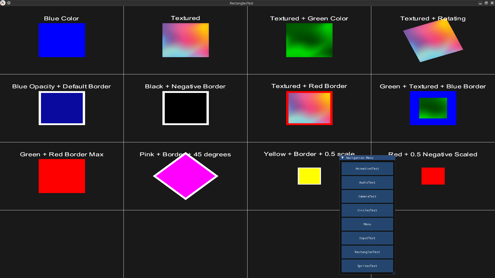
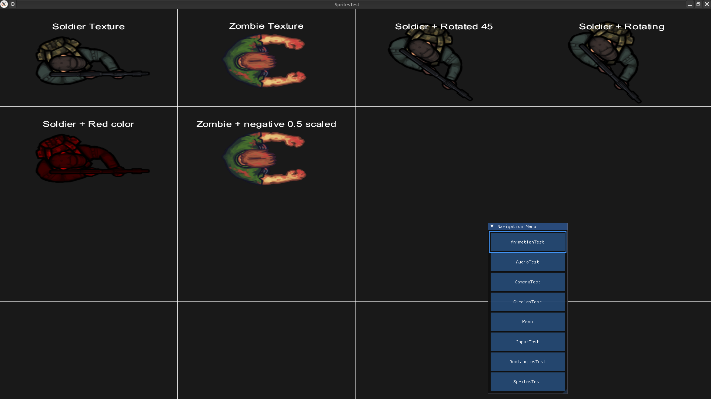
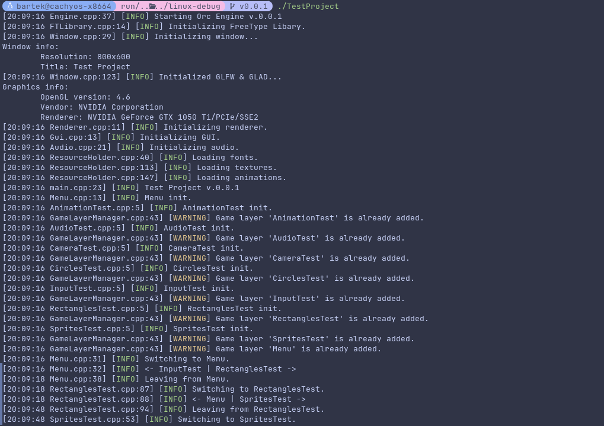

# OrcEngine

OrcEngine is a C++20 game engine project with a demo application in `TestProject`.

## Screenshots







## Engine capabilities
- Logging
- Batch rendering of: sprites, text, basic shapes
- FMOD integration

## Planned features
- C# Scripting
- Sprite animations

## Requirements

Supported platform: **Linux** (x86_64).

- CMake 3.25 or newer
- Ninja
- A C++20 compiler (GCC or Clang)
- [vcpkg](https://github.com/microsoft/vcpkg) checkout
- [FMOD Engine](https://www.fmod.com/download) SDK for Linux

### System packages

OpenGL comes from the system, and GLFW (built by vcpkg) needs the X11/Wayland development headers.

Debian/Ubuntu:

```bash
sudo apt install build-essential ninja-build pkg-config \
    libgl1-mesa-dev libx11-dev libxrandr-dev libxinerama-dev libxcursor-dev libxi-dev \
    libxkbcommon-dev libwayland-dev wayland-protocols
```

Arch Linux:

```bash
sudo pacman -S base-devel cmake ninja pkgconf \
    mesa libx11 libxrandr libxinerama libxcursor libxi \
    libxkbcommon wayland wayland-protocols
```

## Dependencies

### vcpkg

Set the environment variable `VCPKG_ROOT` to your vcpkg directory. Open-source dependencies are declared in `vcpkg.json` (manifest mode, pinned by `builtin-baseline`) and are installed automatically on the first configure:

- GLFW
- GLAD
- GLM
- fmt
- spdlog
- tinyxml2
- stb
- FreeType
- ImGui with GLFW and OpenGL3 bindings

### FMOD

FMOD cannot be distributed through vcpkg, so the SDK is installed manually. Download the FMOD Engine for Linux and point `FMOD_ROOT` at the directory that contains `api/`:

```text
<FMOD_ROOT>/api/core/inc/fmod.hpp
<FMOD_ROOT>/api/core/inc/fmod_common.h
<FMOD_ROOT>/api/studio/inc/fmod_studio.hpp
<FMOD_ROOT>/api/studio/inc/fmod_studio_common.h
<FMOD_ROOT>/api/core/lib/x86_64/libfmod.so
<FMOD_ROOT>/api/studio/lib/x86_64/libfmodstudio.so
```

`FMOD_ROOT` can be set either as an environment variable:

```bash
export FMOD_ROOT=/path/to/fmodstudioapi<version>linux
```

or as a CMake cache variable, for example in an untracked `CMakeUserPresets.json` (already git-ignored):

```json
{
  "version": 6,
  "configurePresets": [
    {
      "name": "dev-debug",
      "inherits": "linux-debug",
      "cacheVariables": {
        "FMOD_ROOT": "/path/to/fmodstudioapi<version>linux"
      }
    }
  ]
}
```

## Configure and build

From the repository root:

```bash
cmake --preset linux-debug
cmake --build --preset linux-debug
```

Release build:

```bash
cmake --preset linux-release
cmake --build --preset linux-release
```

To build only the engine, configure with `-DORC_BUILD_TEST_PROJECT=OFF`.

## Run

The demo executable is `TestProject`. After each build the FMOD runtime libraries, `assets/` and `shaders/` are copied next to it, so run it from its build directory:

```bash
cd build/linux-debug
./TestProject
```
